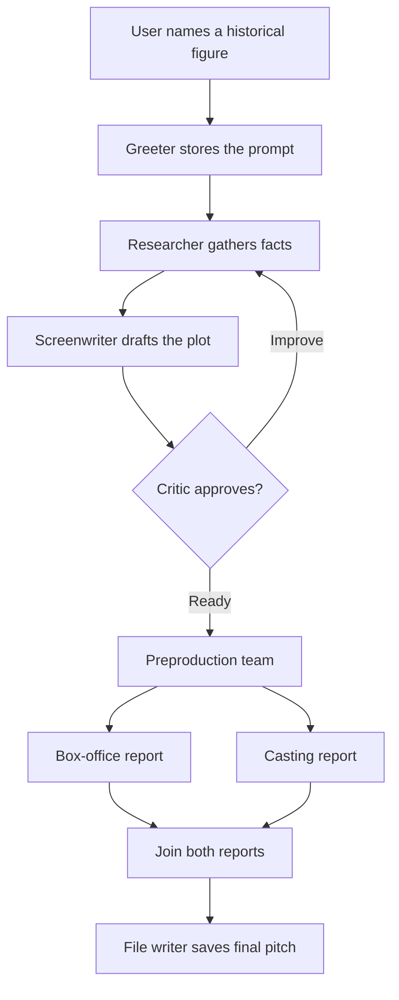
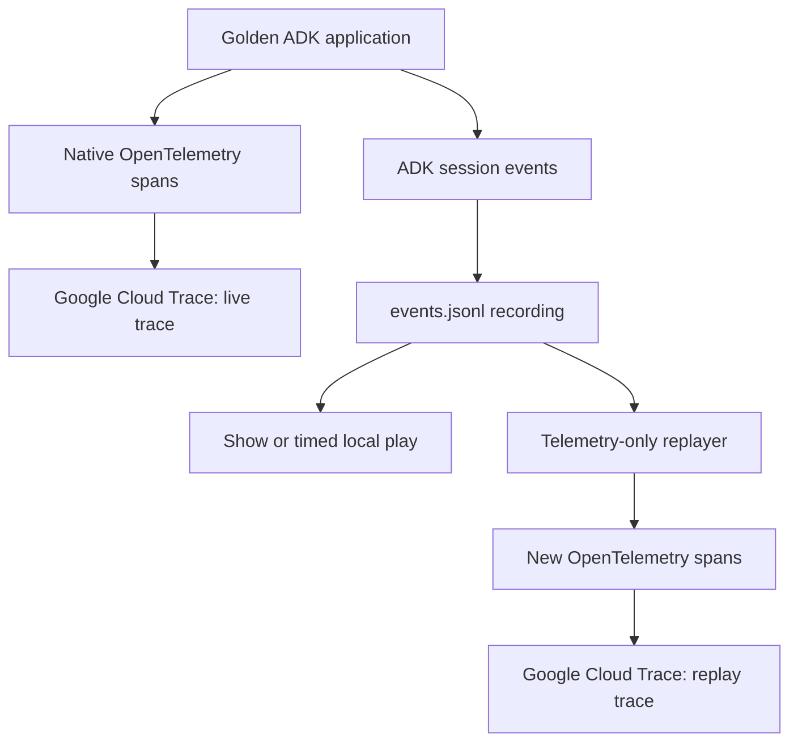

# Class 02C — Observe, Record, Play, and Replay an ADK Agent

## Purpose

Class 02C is a self-contained observability lab. You do **not** need to complete any earlier class, and you will not build a multi-agent system in this lab.

The supplied `class-02C.zip` begins with a **completed golden multi-agent application**. You will use that working application as the system under observation while you learn to:

1. export ADK's native OpenTelemetry spans directly to Google Cloud Trace;
2. inspect a live multi-agent trace;
3. record the ADK session event history as JSONL;
4. show and play the recorded events locally;
5. replay those events as a new trace without calling Gemini or executing tools; and
6. compare a real execution trace with a telemetry-only replay.

Google Cloud Trace is the only observability backend. This lab uses no Jaeger server, Docker container, local collector, or third-party tracing service.

---

## What is already complete

The package contains a working movie-pitch application built with Google ADK. The agent accepts a historical figure, researches the subject, develops and critiques a screenplay, generates two reports in parallel, and writes the final pitch to a text file.

You are **not** expected to edit or rebuild this application. Treat it as a golden reference system whose behavior you will observe.

The main application is named:

```text
workflow_agents
```

The package also contains a smaller `parent_and_subagents` application, but the lab uses `workflow_agents` because its sequential, loop, parallel, model, state, and tool activity creates a richer trace.

### Golden application flow



Under the hood:

- `film_concept_team` is a `SequentialAgent`.
- `writers_room` is a bounded `LoopAgent` containing `researcher`, `screenwriter`, and `critic`.
- The critic exits early when the pitch is good enough; otherwise the loop stops at its configured maximum.
- `preproduction_team` is a `ParallelAgent` containing `box_office_researcher` and `casting_agent`.
- The two parallel branches write results into session state.
- `file_writer` gathers the plot and both reports and writes `movie_pitches/<title>.txt`.

You need this functional picture to read the trace; you do not need to study or change the multi-agent source code.

---

## Observability flow

The live execution and the replay take different paths:



Important distinction:

| Artifact | What it represents | Created by |
|---|---|---|
| Trace | One end-to-end execution | OpenTelemetry instrumentation |
| Span | One timed operation within a trace | ADK runtime, model, workflow, or tool instrumentation |
| Span event | A timestamped annotation inside a span | OpenTelemetry instrumentation |
| ADK Event | A unit of agent conversation or state history | ADK runtime |
| `events.jsonl` | One recorded ADK Event per line | This lab's recording step |
| Replay trace | A new trace reconstructed from recorded events | The supplied replay utility |

An ADK Event is not the same thing as an OpenTelemetry span event.

---

## Learning objectives

By the end of the lab, you can:

- explain trace, span, parent span, attribute, event, status, and duration;
- relate the trace waterfall to sequential, loop, parallel, model, and tool activity;
- separate model authentication from telemetry authentication;
- export native ADK telemetry directly to Google Cloud Trace;
- retrieve and record an ADK session's ordered event history;
- inspect and play a JSONL recording without rerunning the agent;
- replay event metadata into a new trace without reproducing side effects; and
- explain what telemetry replay does and does not prove.

---

## Prerequisites

Use a Bash terminal such as Google Cloud Shell, Linux, or macOS Terminal.

You need:

- Python 3.11, 3.12, or 3.13;
- the Google Cloud CLI (`gcloud`);
- `curl`, `jq`, and `unzip`;
- a Google Cloud project;
- permission to enable APIs or a project where the required APIs are already enabled;
- permission to write and view Cloud Trace data; and
- either Vertex AI access or a Google AI Studio API key for Gemini.

Confirm the command-line tools:

```bash
python3 --version
gcloud --version
curl --version
jq --version
unzip -v | head -n 2
```

---

## Lab files

After extraction, the important paths are:

```text
class-02C/
├── adk_multiagent_systems/       # Completed golden agent applications
│   ├── workflow_agents/          # The application used in this lab
│   ├── parent_and_subagents/     # A smaller application, not used here
│   └── shared/                   # Helper package shared by both applications
├── movie_pitches/                # Generated movie-pitch files
├── scripts/                      # Package validation utilities
│   ├── validate_package.py
│   └── check_progress.py
├── class-02C-work/               # Observability helpers and generated evidence
│   ├── start_api_server.sh
│   ├── run_and_record.sh
│   ├── show_events.sh
│   ├── play_events.sh
│   ├── replay_events.py
│   ├── verify_golden_source.sh
│   └── golden-source.sha256
├── .env.api-key.example
├── .env.vertex.example
├── pyproject.toml
├── README.md
└── class_02C_instructions.md     # This lab
```

Generated session and recording files remain under `class-02C-work/`. You do not need to modify the golden agent source.


---

## Task 1 — Expand and install the complete package

```bash
unzip class-02C.zip
cd class-02C
```

Create an isolated Python environment and install the application plus the Google Cloud OpenTelemetry integration:

```bash
python3 -m venv .venv
source .venv/bin/activate
python -m pip install --upgrade pip
python -m pip install -e .
```

`pyproject.toml` already declares `google-adk[gcp,otel-gcp]==2.6.0`, so the
editable install pulls the Google Cloud OpenTelemetry exporters with it. There is
no second install step.

Verify the installation:

```bash
python -c "import google.adk; print('ADK', google.adk.__version__)"
python scripts/validate_package.py
```

`validate_package.py` exercises the package's `Graceful429Plugin` by handing it a
synthetic quota error, so it prints a warning on the way to succeeding:

```text
WARNING:adk_multiagent_systems.shared.plugins:Model quota exhausted in plugin validation_plugin
```

That line is expected. No model was called and no quota was consumed — it is the
fallback plugin proving it works. The run is successful when the last line reads
`Validation passed. No model API call was made.`

Verify that this is the completed golden application:

```bash
rg -n "TODO [2356][A-D]" adk_multiagent_systems || true
python scripts/check_progress.py
```

Expected result:

- the `rg` command prints no incomplete exercise markers; and
- every progress check reports `PASS`:

```text
Delegation: PASS ['travel_brainstormer', 'attractions_planner']
Session-state tool: PASS
Sequential team: PASS ['writers_room', 'preproduction_team', 'file_writer']
Writers-room loop: PASS ['researcher', 'screenwriter', 'critic']
Parallel fan-out and join: PASS ['box_office_researcher', 'casting_agent']
All checkpoints PASS. This is the completed golden application.
```

Each line names one stage of the golden application's topology. The checker is an acceptance gate: it exits non-zero if any stage is missing.

Optionally confirm that nothing in the golden source has been modified:

```bash
./class-02C-work/verify_golden_source.sh
```

If those expectations are not met, stop. The ZIP contains the wrong source version; students should not repair it during this observability lab.

---

## Task 2 — Configure model authentication

Choose **one** authentication mode.

### Option A — Vertex AI (now the Gemini Enterprise Agent Platform)

Google renamed Vertex AI to the Gemini Enterprise Agent Platform in 2026, and the
old name no longer appears in the Cloud console. The `GOOGLE_GENAI_USE_VERTEXAI`
variable and the `aiplatform.googleapis.com` service are unchanged — only the
product name moved.

Set your Google Cloud project and authenticate:

```bash
export PROJECT_ID=replace_with_your_google_cloud_project_id
gcloud config set project "$PROJECT_ID"
gcloud auth login
gcloud auth application-default login
gcloud auth application-default set-quota-project "$PROJECT_ID"
```

Create `.env` from the supplied template:

```bash
cp .env.vertex.example .env
nano .env
```

Use `cp`, not `mv`. The `.example` templates are part of the golden source, and
moving one makes `verify_golden_source.sh` fail with a misleading
`No such file or directory` that looks like a corrupted download.

Set these values in `.env`:

```dotenv
GOOGLE_GENAI_USE_VERTEXAI=TRUE
GOOGLE_CLOUD_PROJECT=replace_with_your_google_cloud_project_id
GOOGLE_CLOUD_LOCATION=us-central1
MODEL=gemini-2.5-flash
```

Save the file and return to the terminal.

### Option B — Google AI Studio API key

Set the Google Cloud project used for telemetry:

```bash
export PROJECT_ID=replace_with_your_google_cloud_project_id
gcloud config set project "$PROJECT_ID"
gcloud auth application-default login
gcloud auth application-default set-quota-project "$PROJECT_ID"
```

Create `.env` from the supplied template:

```bash
cp .env.api-key.example .env
nano .env
```

Set these values in `.env`:

```dotenv
GOOGLE_GENAI_USE_VERTEXAI=FALSE
GOOGLE_API_KEY=replace_with_your_google_ai_studio_api_key
MODEL=gemini-2.5-flash
```

The API key authenticates the Gemini request. Application Default Credentials authenticate writes to Google Cloud Trace. They are separate authentication paths.

Protect `.env`:

```bash
chmod 600 .env
```

Never commit or share `.env`.

### Choosing the model

`MODEL` is read from `.env` by every agent in both applications, through
`MODEL_NAME` in `adk_multiagent_systems/shared/runtime.py`:

```python
MODEL_NAME = os.getenv("MODEL", "gemini-2.5-flash")
```

It is optional — omit it and the application still runs on `gemini-2.5-flash`.
Because it is an ordinary environment variable, you can also override it for a
single run without editing `.env`:

```bash
MODEL=gemini-2.5-pro ./class-02C-work/start_web_server.sh
```

That makes a useful comparison once you reach Task 7: run the same pitch on two
models and compare `gen_ai.usage.*` token counts and span durations in the two
traces. Keep `gemini-2.5-flash` for your first pass through the lab.

---

## Task 3 — Prepare Google Cloud Trace

First check what is already enabled:

```bash
gcloud services list --enabled --project="$PROJECT_ID" \
  | grep -E 'cloudtrace|logging|monitoring|aiplatform'
```

Managed classroom projects, Qwiklabs projects included, normally have all four
enabled already. If all four are listed, continue to the credential check below.

Only if something is missing, enable it:

```bash
gcloud services enable \
  cloudtrace.googleapis.com \
  logging.googleapis.com \
  monitoring.googleapis.com \
  aiplatform.googleapis.com \
  --project="$PROJECT_ID"
```

> **Expected in a classroom project.** `gcloud services enable` often fails in a
> lab project with `FAILED_PRECONDITION: the terms of service 'cloud' ... must be
> accepted` (`UREQ_TOS_NOT_ACCEPTED`), because a student account cannot accept
> the Google Cloud terms of service. That error is harmless **as long as the
> services are already enabled** — confirm with the `list --enabled` command
> above and carry on.

Confirm that Application Default Credentials work:

```bash
gcloud auth application-default print-access-token >/dev/null \
  && echo "Application Default Credentials: OK"
```

Confirm the selected project:

```bash
echo "PROJECT_ID=$PROJECT_ID"
gcloud config get-value project
```

### Required IAM access

The runtime identity normally needs `roles/cloudtrace.agent` to write traces. The person opening Trace Explorer normally needs `roles/cloudtrace.user` to view them.

In a managed classroom project, ask the administrator to provision these roles. Do not grant broad Owner or Editor access merely to make the lab work.

---

## Task 4 — Start the golden application with native telemetry

Open **Terminal 1** in `class-02C`:

```bash
source .venv/bin/activate
export PROJECT_ID=replace_with_your_google_cloud_project_id
./class-02C-work/start_api_server.sh "$PROJECT_ID"
```

The helper:

- loads `.env`;
- sets `GOOGLE_CLOUD_PROJECT`;
- labels the live service `class-02c-live`;
- sets the `gen_ai.*` OpenTelemetry attributes to capture no message content;
- stores sessions in `class-02C-work/sessions.db`; and
- starts `adk api_server` with `--otel_to_cloud` and `--no-reload` on port `8000`.

`--no-reload` is used because auto-reload cannot be combined with an in-process application object; without it Uvicorn prints a warning and disables reload anyway.

> **Read this before you start the server.** Your prompts and the model's replies
> are sent to Google Cloud Trace. ADK has two independent content-capture
> switches, and the helper sets only the first:
>
> | Variable | Governs | In this lab |
> |---|---|---|
> | `OTEL_INSTRUMENTATION_GENAI_CAPTURE_MESSAGE_CONTENT` | the `gen_ai.*` attributes | `NO_CONTENT` |
> | `ADK_CAPTURE_MESSAGE_CONTENT_IN_SPANS` | ADK's own `gcp.vertex.agent.llm_request` and `llm_response` attributes | **left on deliberately** |
>
> The second is left on so you can see for yourself what telemetry really
> captures; Task 7 asks you to go and find it. Until you turn it off, everything
> you type and everything the model writes is readable in Cloud Trace by anyone
> holding `roles/cloudtrace.user` on this project. Type nothing you would not
> want stored there.

The first time you run any `adk` command it asks whether to share usage
telemetry with Google, and waits for an answer:

```text
Enable telemetry? [Y/n]:
```

Answer it, or settle it once before starting the server:

```bash
adk telemetry disable
```

Expected final line:

```text
Uvicorn running on http://127.0.0.1:8000
```

Leave Terminal 1 running.

ADK's `--otel_to_cloud` option sends native OpenTelemetry data directly to Google Cloud Observability. It does not require a separate collector for this lab.

Both start helpers read `GOOGLE_CLOUD_PROJECT` from `.env` after loading it, so a
correctly filled `.env` is enough on its own; the `PROJECT_ID` export and the
argument are optional overrides.

### Optional — watch the agent work in the ADK web UI

`start_web_server.sh` is `start_api_server.sh` with `adk web` in place of
`adk api_server`. It serves the same REST API on the same port and writes to the
same `sessions.db`, and adds a browser UI at <http://127.0.0.1:8000> with Trace,
Events, State, Artifacts and Graph panels:

```bash
./class-02C-work/start_web_server.sh
```

Run one server or the other — both bind port 8000. The web UI is worth using
once: its Trace panel shows the same span tree you are about to look for in
Cloud Trace, and its Events panel shows the raw ADK Events you are about to
record.

If you drive the agent from the web UI, record that session rather than running
the agent a second time:

```bash
./class-02C-work/record_session.sh
```

`record_session.sh` produces the same `events.jsonl` as `run_and_record.sh` but
executes nothing: it fetches the newest session for `workflow_agents` and writes
its event history. The web UI files sessions under user id `user`; pass
`USER_ID=...` to override.

---

## Task 5 — Confirm that ADK discovered the applications

Open **Terminal 2**:

```bash
cd class-02C
source .venv/bin/activate
curl -sS http://127.0.0.1:8000/list-apps | jq .
```

Expected applications:

```json
[
  "parent_and_subagents",
  "shared",
  "workflow_agents"
]
```

ADK lists every subdirectory of the agents directory, so the `shared` helper package appears alongside the two real applications. That is expected; `shared` holds common configuration, callbacks, and plugins rather than an agent, and you will not run it.

The remainder of the lab uses `workflow_agents`.

---

## Task 6 — Run the agent and record its session events

From Terminal 2:

```bash
export PROJECT_ID=replace_with_your_google_cloud_project_id
export APP_NAME=workflow_agents
export USER_ID=class02c-user
export SESSION_ID="class02c-$(date +%Y%m%d-%H%M%S)"

./class-02C-work/run_and_record.sh "Ada Lovelace"
```

The helper performs four actions:

1. creates a new persistent ADK session;
2. sends `Hello` so the greeter asks for a historical figure;
3. sends `Ada Lovelace` to start the full movie-pitch workflow; and
4. retrieves the complete session and writes one ADK Event per line to `class-02C-work/events.jsonl`.

This is the only task that calls Gemini, invokes the real workflow, calls tools, changes session state, and writes a movie-pitch file.

Confirm the evidence files:

```bash
ls -lh class-02C-work/run-01.json \
       class-02C-work/run-02.json \
       class-02C-work/session.json \
       class-02C-work/events.jsonl

wc -l class-02C-work/events.jsonl
jq -s 'length' class-02C-work/events.jsonl
find movie_pitches -maxdepth 1 -type f -print
```

The two event counts should match and be greater than zero.

---

## Task 7 — Inspect the live trace in Google Cloud

In Google Cloud Console:

1. select the project stored in `PROJECT_ID` in the console project picker;
2. open **Observability → Trace → Trace explorer**, or type `Trace Explorer` into
   the console search bar — the search bar survives console reorganisations;
3. set the time window to the last 1 hour;
4. set the trace scope to the current project if necessary;
5. in **Span filters**, tick **OpenTelemetry service** → `class-02c-live`;
6. open the newest trace; and
7. switch the detail view from **Graph** to **Timeline**, then expand the waterfall.

> **The Agent Platform console is the wrong place.** Agent Registry, Sessions
> services, Deployments and Memory Bank list resources *deployed to* Agent
> Platform. This lab runs ADK on your own machine, so those pages stay empty.
> Only the OpenTelemetry spans leave your machine, and they arrive in Cloud
> Trace.

> **Filter before you read.** Unfiltered, most spans in the project are named `/`
> with no service name — those are the web server's own HTTP spans. Filtering by
> OpenTelemetry service removes them.

**Timeline** shows duration and overlap; **Graph** shows call structure. Use
Timeline for the questions below and Graph to see the topology.

Find evidence of:

- the root invocation;
- the greeter and workflow handoff;
- repeated researcher, screenwriter, and critic work;
- model-generation spans;
- tool calls and state changes;
- the two parallel preproduction branches; and
- the final file-writing stage.

For three spans, record:

| Span | Parent | Duration | Important attributes | What it tells you |
|---|---|---:|---|---|
| Root invocation |  |  |  |  |
| One model call |  |  |  |  |
| One tool or workflow span |  |  |  |  |

Trace ingestion is asynchronous. A new project can take several minutes to show its first trace.

### See what the telemetry captured

Open any `call_llm` span and read its attributes. Beside the `gen_ai.*` metadata
you will find two more:

- `gcp.vertex.agent.llm_request` — the full system instruction and the entire
  conversation history sent to the model, tool results included; and
- `gcp.vertex.agent.llm_response` — the complete generated text.

The `gen_ai.*` attributes carry only metadata — model name, finish reason, token
counts — because the helper sets
`OTEL_INSTRUMENTATION_GENAI_CAPTURE_MESSAGE_CONTENT=NO_CONTENT`. That variable
has no authority over ADK's own attributes.

Now turn the other switch off and watch the difference. Stop the server, then
start it again with:

```bash
ADK_CAPTURE_MESSAGE_CONTENT_IN_SPANS=false ./class-02C-work/start_api_server.sh
```

Repeat Task 6, open the new trace, and confirm that both `gcp.vertex.agent.*`
attributes now read `{}` while the token counts and model name are unchanged.

Which setting would you choose for a production agent, and what would you give
up either way?

---

## Task 8 — Show the recorded ADK Events

Display the complete event sequence as a compact table:

```bash
./class-02C-work/show_events.sh
```

The columns show:

- `SEQ`: the event's position in the recording;
- `TIME`: the recorded timestamp;
- `AUTHOR`: the user, agent, or workflow that produced the event;
- `PART TYPES`: text, function call, function response, or other content; and
- `STATE KEYS`: state fields changed by the event.

Inspect one raw event:

```bash
head -n 1 class-02C-work/events.jsonl | jq .
```

Inspect the distinct authors:

```bash
jq -r '.author // "unknown"' class-02C-work/events.jsonl | sort -u
```

Inspect events that changed state:

```bash
jq -c 'select((.actions.stateDelta // {}) | length > 0) | {
  timestamp,
  author,
  stateDelta: .actions.stateDelta
}' class-02C-work/events.jsonl
```

The JSONL file is a portable classroom recording. It is not another observability backend.

---

## Task 9 — Play the event recording

Play the event sequence with a `0.75` second delay:

```bash
./class-02C-work/play_events.sh class-02C-work/events.jsonl 0.75
```

Try a faster playback:

```bash
./class-02C-work/play_events.sh class-02C-work/events.jsonl 0.20
```

Playback only reads the local JSONL file. It does not contact ADK, Gemini, Wikipedia, or Google Cloud and cannot repeat the file-writing side effect.

---

## Task 10 — Preview the telemetry replay

Before exporting anything, inspect what the replayer plans to create:

```bash
python class-02C-work/replay_events.py \
  class-02C-work/events.jsonl \
  --dry-run
```

Expected pattern:

```text
Would replay <N> events
001 user: text
002 greeter: text
...
```

The dry run reads and classifies events but emits no telemetry.

---

## Task 11 — Replay the recording into Google Cloud Trace

Export a new telemetry-only trace:

```bash
export GOOGLE_CLOUD_PROJECT="$PROJECT_ID"

python class-02C-work/replay_events.py \
  class-02C-work/events.jsonl \
  --project-id "$PROJECT_ID" \
  --speed 4
```

Expected result:

```text
Replayed <N> events to Google Cloud Trace in project <PROJECT_ID>
```

The replayer exits non-zero and prints `Export FAILED` if Cloud Trace rejects the
spans, so a zero exit status means the trace genuinely arrived. Add `--debug` for
the exporter's own diagnostics.

The replay utility:

- creates a new root span named `replay.adk.session`;
- creates one child span per recorded ADK Event;
- copies selected non-content metadata into span attributes;
- preserves event ordering and scales relative timing; and
- labels the service `class-02c-replay`.

It does **not** import the agent application, call Gemini, invoke Wikipedia, execute tools, mutate session state, or write a second movie-pitch file.

---

## Task 12 — Compare the live and replay traces

Return to Trace Explorer:

1. use the last 1 hour as the time range;
2. in **Span filters**, tick **OpenTelemetry service** → `class-02c-replay`;
3. open the newest `replay.adk.session` trace;
4. inspect its child spans and `recorded.*` attributes; and
5. compare it with the earlier `class-02c-live` trace.

| Live trace | Replay trace |
|---|---|
| Produced by real ADK execution | Produced from `events.jsonl` |
| Contains native runtime, agent, model, and tool spans | Contains one reconstructed span per recorded event |
| Measures real latency | Uses scaled relative event timing |
| Can call models and tools | Calls no model and executes no tool |
| Has original trace and span IDs | Has new trace and span IDs |
| Proves what ran at that moment | Reconstructs the recorded event story |

Answer these questions:

1. Which live span consumed the most time? Compare leaf spans, not parents — the
   answer is rarely the stage you would guess.
2. Find the `execute_tool exit_loop` span. What ended the loop, and how many
   times did `researcher` → `screenwriter` → `critic` actually run? If the critic
   approved on its first pass the loop ran once, and the trace shows you the
   decision rather than the repetition.
3. Where can you see parallel fan-out and join?
4. Which ADK Events changed state?
5. Why are the replay trace IDs and durations different?
6. Why is telemetry replay safer and cheaper than rerunning the agent?
7. What debugging questions require the live trace rather than the replay?

---

## Success criteria

The lab is complete when:

- [ ] the supplied golden application passes its validation checks;
- [ ] the application runs with `--otel_to_cloud`;
- [ ] Trace Explorer displays a `class-02c-live` trace;
- [ ] the student can identify sequential, loop, and parallel behavior in the trace;
- [ ] `events.jsonl` contains the ordered ADK session history;
- [ ] the show utility displays authors, part types, and state keys;
- [ ] the play utility works without calling the agent;
- [ ] the dry-run replay classifies the recording;
- [ ] Trace Explorer displays a `class-02c-replay` trace;
- [ ] no second model execution or tool side effect occurs during replay; and
- [ ] the student can explain why live execution and telemetry replay are different.

---

## Troubleshooting

### `rg: command not found`

The `rg` verification is convenient but optional. Run the progress checker:

```bash
python scripts/check_progress.py
```

### `adk: command not found`

```bash
cd class-02C
source .venv/bin/activate
which python
which adk
python -m pip install -e .
```

### `check_progress.py` reports `TODO`, or `rg` finds `TODO` markers

The package is not the completed golden application. Stop and request the correct ZIP. Do not attempt to build the missing agents yourself: this is an observability lab, and Tasks 6, 7, and 12 assume the loop and parallel stages already exist.

### `Missing class-02C/.env`

Create `.env` from exactly one supplied template:

```bash
cp .env.vertex.example .env
```

or:

```bash
cp .env.api-key.example .env
```

Then edit the placeholder values and protect the file with `chmod 600 .env`.

### `/list-apps` does not show `workflow_agents`

Stop Terminal 1 with `Ctrl-C`, return to the package root, and restart:

```bash
cd class-02C
source .venv/bin/activate
./class-02C-work/start_api_server.sh "$PROJECT_ID"
```

Read any import error shown before the Uvicorn startup message.

### `Session already exists`

Create a unique ID:

```bash
export SESSION_ID="class02c-$(date +%Y%m%d-%H%M%S)"
```

Then rerun `run_and_record.sh`.

### The model works but Cloud Trace export fails

Model authentication and telemetry authentication are separate. Check:

```bash
echo "$PROJECT_ID"
gcloud config get-value project
gcloud auth application-default print-access-token >/dev/null \
  && echo "ADC: OK"
gcloud services list \
  --enabled \
  --project="$PROJECT_ID" \
  --filter='name:cloudtrace.googleapis.com'
```

Also confirm that the runtime identity can write traces and the console user can view traces.

### The agent ran, but no trace appears

- Confirm that Terminal 1 used `start_api_server.sh`, which includes `--otel_to_cloud`.
- Confirm that the Cloud Console project matches `PROJECT_ID`.
- Set Trace Explorer's scope to the current project.
- Widen the time range to one hour.
- Wait several minutes and refresh; ingestion is asynchronous.
- Run a new session so the exporter receives fresh spans.

### `events.jsonl` is empty or missing

Confirm that the server is still running and that the agent run completed:

```bash
curl -sS http://127.0.0.1:8000/list-apps | jq .
ls -lh class-02C-work/run-*.json
```

Then run the recorder again with a new `SESSION_ID`.

### Replay succeeds, but `class-02c-replay` is not visible

Confirm that all project values match:

```bash
echo "$PROJECT_ID"
echo "$GOOGLE_CLOUD_PROJECT"
gcloud config get-value project
```

Wait several minutes, widen the time range, and filter for `class-02c-replay` or span name `replay.adk.session`.

### Replay durations differ from the live run

This is expected. Replay preserves order and selected metadata but scales relative timestamps. It is not a performance benchmark or deterministic re-execution.

---

## Privacy and safety

The live server sets:

```bash
OTEL_INSTRUMENTATION_GENAI_CAPTURE_MESSAGE_CONTENT=NO_CONTENT
```

This prevents prompt and response content from being copied into the exported telemetry. However, the local `events.jsonl` session recording can still contain user messages, model responses, tool arguments, tool results, and state.

Use only synthetic classroom prompts. Do not record passwords, API keys, personal information, customer data, regulated data, or confidential material. Do not commit `.env`, `sessions.db`, run JSON, session JSON, or `events.jsonl` to source control.

---

## Clean up generated evidence

Stop the API server in Terminal 1 with `Ctrl-C`.

To preserve evidence for review, keep:

```text
class-02C-work/session.json
class-02C-work/events.jsonl
```

To reset before teaching the lab again, remove only the generated files listed below:

```bash
rm -f class-02C-work/sessions.db \
      class-02C-work/run-01.json \
      class-02C-work/run-02.json \
      class-02C-work/session.json \
      class-02C-work/events.jsonl \
      class-02C-work/last_session.env
```

This cleanup does not delete the golden source code.

---

## Official references

- [ADK Google Cloud Trace integration](https://google.github.io/adk-docs/observability/cloud-trace/)
- [ADK API server](https://google.github.io/adk-docs/runtime/api-server/)
- [ADK CLI 2.6.0](https://google.github.io/adk-docs/api-reference/cli/)
- [ADK sessions](https://google.github.io/adk-docs/sessions/session/)
- [Google Cloud Trace setup](https://docs.cloud.google.com/trace/docs/setup)
- [Google Cloud Trace IAM](https://docs.cloud.google.com/trace/docs/iam)
- [Find and explore traces](https://docs.cloud.google.com/trace/docs/finding-traces)
